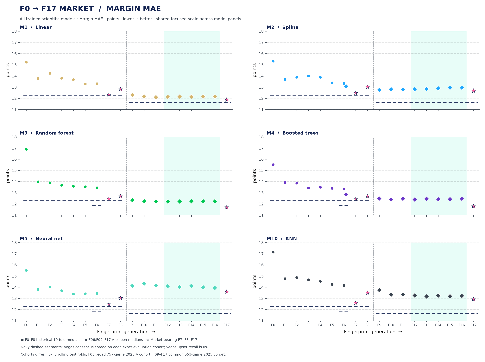

# All fingerprints: full scientific-model panel

Four scatter figures show **margin MAE, upset recall, winner accuracy, and Brier score** across all model IDs with completed results: M1–M5 and M10 (KNN). The model facets, point shapes, repo palette, mint F12–F16 band, market stars, and navy dashed Vegas references follow the earlier M2/M4 figure style.

Open the metric-specific plots:

- [Upset recall](all_fingerprints_f0_f17_upset_recall_all_architectures.svg)
- [Winner accuracy](all_fingerprints_f0_f17_winner_accuracy_all_architectures.svg)
- [Brier score](all_fingerprints_f0_f17_brier_score_all_architectures.svg)

The [3D metric landscape](all_fingerprints_f0_f17_3d.svg) places each of the 110 model–fingerprint results by MAE, winner accuracy, and Brier score. Color identifies model; marker shape identifies historical, broad 2025, narrow 2025, or market data. Its axes are tightened to the model results, and the still figure's pink arrow shows one standard deviation along the favorable PCA direction. The [model-colored rotation](all_fingerprints_f0_f17_3d_rotation.gif) shows the points without that arrow; the [generation-colored rotation](all_fingerprints_f0_f17_3d_rotation_by_generation.gif) uses red for earlier generations and blue for later ones, with marker shape identifying model. PCA rankings are available for [models](all_fingerprints_f0_f17_pca_model_ranking.csv), [fingerprints](all_fingerprints_f0_f17_pca_fingerprint_ranking.csv), and [exact model–fingerprint pairs](all_fingerprints_f0_f17_pca_pair_ranking.csv).

All plots cover F0–F17. Historical F0–F8 points are the median of ten rolling test folds (2015–2024) for each model. The separate F06 full-A point is shown only for M2/M4, from its 757-game 2025 development cohort. F09–F17 use the common 553-game 2025 evaluation cohort: M2/M4 are medians over ten setpoints and M1/M3/M5/M10 are medians over three seeds. Corrected F12 is the only F12 point; original F12 is excluded. F17_market remains a retrospective market research branch. The 2024/2025 evaluations informed fingerprint design and remain development evidence. Differences across these cohorts/programs are descriptive, not paired gains.

Each figure uses the same rounded, focused y-axis range across all six model panels, padded around the observed model and Vegas values so differences are easier to see. The ranges are MAE 11–18 points, upset recall 0–45%, winner accuracy 55–80%, and Brier 0.15–0.29. Vegas is scored on the exact historical, broad, and narrow evaluation cohorts. Its upset recall is zero because it always selects the market favorite. For Brier, the available spread-only records do not contain implied probabilities, so the plotted Vegas reference uses an explicitly hard 0/1 favorite forecast; it is not a calibrated market-probability Brier score.

Upset recall is the share of market-underdog wins correctly picked. The historical evaluator's `upset_correct` preserves its legacy market-favorite convention (including pick'em lines); the 2025 evaluation reports `upset_accuracy`. Winner accuracy is the share of all games with the correct winner pick. Brier is computed from the models' home-win probabilities. Metric summaries are computed separately, so their medians can come from different folds, setpoints, or seeds.

The exact plotted values and source summaries are in [`all_architectures_scatter_data.csv`](all_architectures_scatter_data.csv), [`all_architectures_historical_folds.csv`](all_architectures_historical_folds.csv), [`all_architectures_vegas_baseline_data.csv`](all_architectures_vegas_baseline_data.csv), and [`all_architectures_vegas_historical_folds.csv`](all_architectures_vegas_historical_folds.csv). The output hashes and source digest are recorded in [`all_architectures_harvest_receipt.json`](all_architectures_harvest_receipt.json). Reproduce with [`plot_full_architecture_fingerprint_landscape.py`](../../../scripts/plot_full_architecture_fingerprint_landscape.py).

## Earlier M2/M4 view

The earlier three-metric M2/M4 scatter, with its supporting values, remains available as [`all_fingerprints_f0_f17_scatter.svg`](all_fingerprints_f0_f17_scatter.svg) and [`all_fingerprints_scatter_data.csv`](all_fingerprints_scatter_data.csv). The full-model bundle above adds Brier and the rest of the trained model panel.
