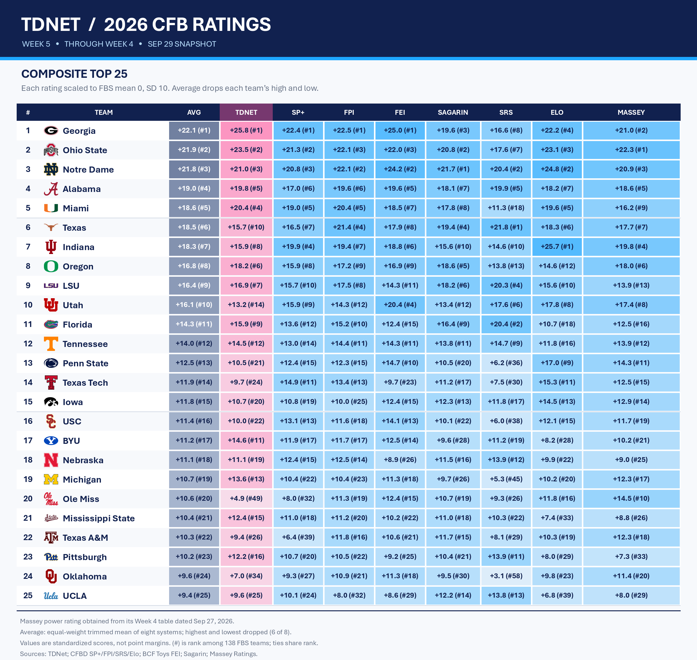

# TDNet 2026 Week 5 predictions

## Ratings comparison

The [Top 25 ratings comparison](../tables/ratings_comparison_top25.csv) includes TDNet, SP+, FPI, FEI, Sagarin, SRS, Elo, and Massey. Each system is standardized across the same 138 FBS teams to a mean of zero and standard deviation of ten. The composite equally averages the six remaining values after dropping each team's highest and lowest. The number in parentheses beside each score is that column's rank among all 138 FBS teams; ties share a rank. These values compare relative team strength; they are not predicted point margins. [Source details and file hashes](../metadata/ratings_comparison_manifest.json) accompany the graphic.

This report covers **56 games** using consensus predictions from **33 models**.

Margins are reported as the predicted winner's advantage. The canonical tables retain signed home margins.

## Ranked-team games

Ranked-team designation uses **AP Top 25**.

- Notre Dame at North Carolina: **Notre Dame by 11.6** (91% model agreement).
- Miami at Clemson: **Miami by 10.1** (100% model agreement).
- Ohio State at Iowa: **Ohio State by 9.5** (97% model agreement).
- Indiana at Rutgers: **Indiana by 13.6** (100% model agreement).
- Alabama at Mississippi State: **Alabama by 2.2** (79% model agreement).
- Florida at Missouri: **Florida by 1.6** (79% model agreement).
- BYU at TCU: **BYU by 8.9** (97% model agreement).
- Texas Tech at Colorado: **Texas Tech by 14.8** (100% model agreement).
- Kentucky at South Carolina: **South Carolina by 5.5** (100% model agreement).
- Vanderbilt at Georgia: **Georgia by 22.6** (100% model agreement).
- Auburn at Tennessee: **Tennessee by 11.5** (100% model agreement).
- Washington at USC: **USC by 5.4** (94% model agreement).
- UCF at Houston: **Houston by 9.7** (97% model agreement).
- Boston College at SMU: **SMU by 15.5** (100% model agreement).
- Utah State at Boise State: **Boise State by 16.2** (100% model agreement).

## Closest projected games

- Akron at Central Michigan: **Akron by 0.0** (61% model agreement).
- Oregon State at Colorado State: **Colorado State by 0.1** (58% model agreement).
- San José State at Hawai'i: **Hawai'i by 0.3** (58% model agreement).
- Baylor at Arizona State: **Baylor by 0.7** (67% model agreement).
- West Virginia at Iowa State: **Iowa State by 1.3** (79% model agreement).
- Pittsburgh at Virginia Tech: **Virginia Tech by 1.6** (58% model agreement).
- Florida at Missouri: **Florida by 1.6** (79% model agreement).
- North Texas at Tulsa: **North Texas by 1.7** (82% model agreement).
- Penn State at Northwestern: **Northwestern by 1.9** (70% model agreement).
- Alabama at Mississippi State: **Alabama by 2.2** (79% model agreement).

## Caveats

These are model predictions, not betting advice. Any comparison with market lines must identify whether a model used market features and must use lines captured before the prediction deadline.
